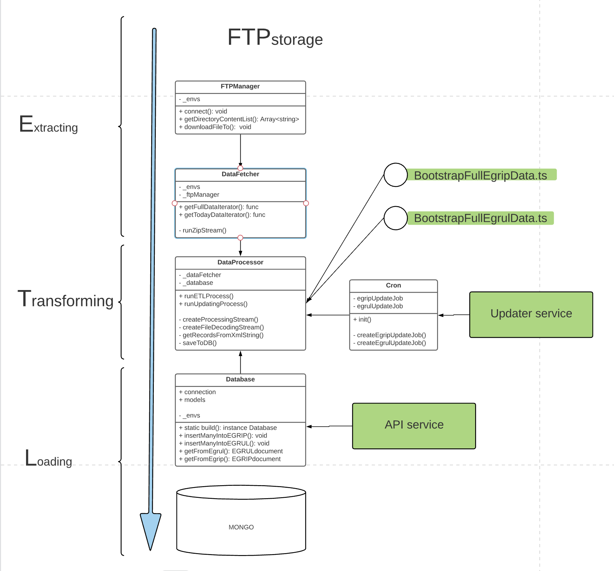

# rosanketa-FNS-ms

## Запуски
Перед запуском проверьте,чтобы в корне был файл .env с содержанием,
соответсствующим fns-etl/src/Environment/EnvVarsDTO.ts 
### Локальный запуск контейнеров с Mongo и интерфейсом к ней
VOLUME_ROOT=*path* docker-compose up

где *path* абсолютный путь до тома с данными базы

### Запуск скриптов загрузки полных сведений
node --expose-gc -r ts-node/register src/BootstrapFullEgripData.ts

Скрипт берет управление сборкой мусора, поэтому флаг --expose-gc обязателен.

Скрипт будет загружать полные данные по реестру,хранящиеся 
в папке FULL текущего года (согласно формату указанному в док-ции ФНС)  

### Запуск сервиса ежедневных обновлений
node --expose-gc -r ts-node/register src/BootstrapUpdater.ts

Паттерны для апдейта ИГРИП и ЕГРЮЛ лучше установить разные, чтобы джобы не нагружали сервис одновременно.

### Запуск API
ts-node src/BootstrapAPI.ts

## Концептуальная схема сервиса

